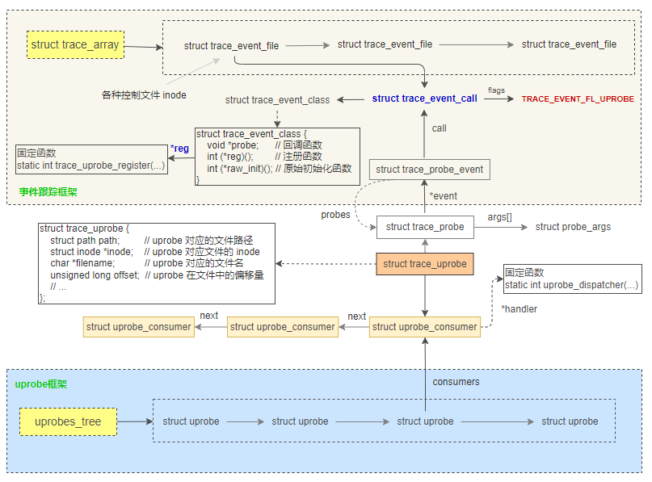

uprobes 于 2012年7月被合并到 linux 3.5 内核中。
uprobes 提供了用户态程序的动态插桩，uprobes 和 kprobes 类似，只是在用户态程序使用。
uprobes 可以在用户态程序的以下为止插桩：函数入口处、特定偏移处、以及函数返回处。 
uprobes 是基于文件的，当一个可执行文件中的一个函数被跟踪时，所有使用到这个文件的进程都会被插桩，包括那些尚未启动的进程。这样就可以在全系统返回内跟踪系统库调用。

uprobes 的工作方式和 kprobes 类似：将一个快速断点指令插入目标指令处，该指令将执行权转交给 uprobes处理函数。当不再需要 uprobes时，目标指令会恢复成原来的样子。对于 uretprobes，也是在函数入口处使用 uprobe 进行插桩，而在函数返回之前，则使用一个蹦床函数1对返回地址进行劫持，和kprobe 类似。

在内核中包含了 register_uprobe_event() 函数 和 register_kprobe() 类似，但是和 kprobes 不同的是，uprobes 并没有以 API 形式暴露使用接口。
在linux中，uprobes 有以下两个可使用的接口：
	• 基于 ftrace 的，通过 /sys/kernel/debug/tracing/uprobe_events：可以通过向这个配置文件写入特定字符串打开或者关闭 uprobes；
	• Perf_event_open(): 和 perf 工具的用法一样。

这篇文章讲述 ftrace + uprobes 的方式， ftrace + perf 放在下一篇。
照例，从使用、设计逻辑和源码解读来了解 uprobes。

**一、使用**

举两个例子，一个是 基于 ftrace的，一个是 perf 的。
1、基于 ftrace 的uprobe 使用示例
以 linux-5.15.60\Documentation\trace\uprobetracer.rst 的一个示例作为介绍。

**二、设计逻辑**

如下图所示，设计逻辑和 kprobe+ftrace 非常相似，不同之处在于 uprobe 框架。

